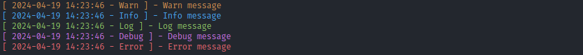

# Lumus log

## About project

The project is a logger that enables you to set up either a file logger or a console logger in your Rust projects with custom output formats.

Here's an example of how the code can be used to build a ConsoleLogger:

```rust
use lumus_logger::ConsoleLogger;


fn main() {
    let logger = ConsoleLogger::new("[ %dt - %i ] - %m");
    logger.warn("Warn message");
    logger.info("Info message");
    logger.log("Log message");
    logger.debug("Debug message");
    logger.error("Error message");
}
```

# Output:



# Format options

| Key  | Value     |
| ---- | --------- |
| %m   | Message   |
| %dt  | Datetime  |
| %d   | Date      |
| %i   | Log Type  |

For `.warn` example above the values for keys are:

| Key  | Value        |
| ---- | ------------ |
| %m   | Warn message |
| %dt  | Y-m-d H:m:s  |
| %d   | Y-m-d        |
| %i   | Warn         |